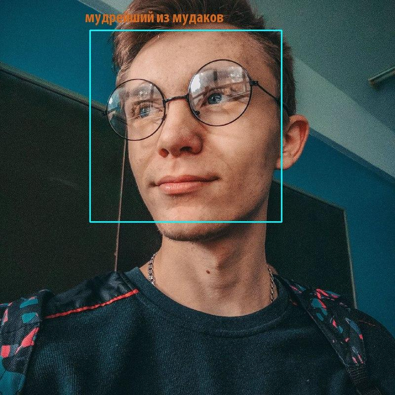

# Funny recognition

## Installation

```bash
cd ~
git clone https://github.com/yope-dev/funny_recognition.git
cd funny_recognition
pip3 install -r requirements.txt
```

After this you should insert your TelegramBot token in **main.py**.

Example:

```python
token = '1442311253:AAF7zzwp1snLOU4-pQxUcxvYvGhbTFSQpLo'
```



## About project

This project is funny, because i starting learn Opencv and PyTelegramBotAPI.
I was interested in putting the training together, so I had the idea of searching for a face in the photo and adding random text.
